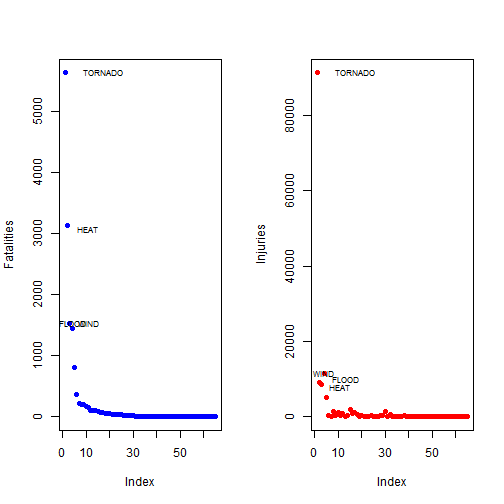
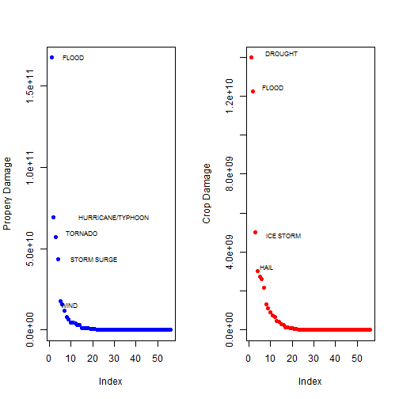

Analysis of Severe Weather
========================================================

Highlights
-----------
The goal of this analysis is to determine the impact of Severe Weather events on public health and material damage. The source of data for this analysis is provided from  National Oceanic and Atmospheric Administration (NOAA). It documents the occurrence of storms and other significant weather phenomena having sufficient intensity to cause loss of life, injuries, significant property damage, and/or disruption to commerce. 

We will be categorizing different weather events that cause the most damage. Data is long-tailed, with only a handful of events causing most of the damage (both material and non-material).

Leading cause of property damage is flood with just under 40 percent, and the leading cause of crop damage is hail (causeing more that 28 percent of the total damage)

Outlier is tornados, which cause over 37 percent of total deaths and 65 percent od total injuries. 


Analysis
-------------------

* Load the data from the compressed file into a data frame.
* Consolidate/Rename weather events.
* Summarize impact of events by type and sort the results.
* For certain types of damage like property and crop damage, added new variables that show amount of damage in dollars.
* Summarized property and crop damage in dollars, grouped by event type.
* Removed events that didn't result in deaths, injuries, property or crop damage.

### Load libraries

```r
library(plyr)
library(poweRlaw)
library(maptools)
```

```
## Loading required package: sp
## Checking rgeos availability: FALSE
##  	Note: when rgeos is not available, polygon geometry 	computations in maptools depend on gpclib,
##  	which has a restricted licence. It is disabled by default;
##  	to enable gpclib, type gpclibPermit()
```


### Read data

```r
## open zip and extract data
zz <- bzfile("repdata-data-StormData.csv.bz2", open = "r")
data <- read.csv(zz)
close(zz)

## Consolidate names of the weather events
data$EVTYPE[grep("WIND", data$EVTYPE)] <- "WIND"
data$EVTYPE[grep("TORNADO", data$EVTYPE)] <- "TORNADO"
data$EVTYPE[grep("HEAT", data$EVTYPE)] <- "HEAT"
data$EVTYPE[grep("SNOW", data$EVTYPE)] <- "SNOW"
data$EVTYPE[grep("FLOOD", data$EVTYPE)] <- "FLOOD"

## check the size of the data
print(object.size(data), units = "Mb")
```

```
## 409.4 Mb
```


### Death and Injuries

```r
## sum deaths and injuries by the event type
total_by_event <- ddply(data, .(EVTYPE), summarise, fatalities = sum(FATALITIES), 
    injuries = sum(INJURIES))

## sort by deaths and ijuries in the descending order
sorted <- arrange(total_by_event, desc(fatalities), desc(injuries))

## remove events that made no damage (in terms of injuries or fatalities)
remove_no_damage <- sorted[(sorted$fatalities > 0 & sorted$injuries > 0), ]
```


### Material Damage

```r
## Create variables that show dollar amount of damage
Mults <- c(M = 10^6, m = 10^6, K = 10^3, k = 10^3, B = 10^9, b = 10^9)
data$sumP <- data$PROPDMG * Mults[as.character(data$PROPDMGEX)]
```

```
## Warning: Name partially matched in data frame
```

```r
data$sumP[is.na(data$sumP)] <- 0

data$sumC <- data$CROPDMG * Mults[as.character(data$CROPDMGEXP)]
data$sumC[is.na(data$sumC)] <- 0

## sum damage by event type
total_by_event2 <- ddply(data, .(EVTYPE), summarise, property = sum(sumP), crops = sum(sumC))
sorted2 <- arrange(total_by_event2, desc(property), desc(crops))

## remove events that made no damage
remove_no_damage2 <- sorted2[(sorted2$property > 0 & sorted2$crops > 0), ]
```


Results
------------

### Death And Injuries Statistics
We can see from the top 10 events in terms of fatalities, that vast majority of the damage comes from only 
a few events (tornado, heat, flood and wind).

We can also see that out of the 570 events, only 65 had any injuries or deaths. Total number of death cases across all causes is 15,047.

Out of the events that did cause death, top event (tornado) is responsible for 37% of total deaths, and top five events for 83% of total deaths.

Statistics for injuries closely follows that for deaths: tornados cause 65% of all injuries and top 5 events cause close to 90% of all the injuries.


```r
## Top 10 events by fatalities and injuries
head(sorted, 10)
```

```
##          EVTYPE fatalities injuries
## 1       TORNADO       5636    91407
## 2          HEAT       3138     9154
## 3         FLOOD       1523     8603
## 4          WIND       1446    11495
## 5     LIGHTNING        816     5230
## 6   RIP CURRENT        368      232
## 7     AVALANCHE        224      170
## 8  WINTER STORM        206     1321
## 9  RIP CURRENTS        204      297
## 10         SNOW        162     1118
```

```r
dim(sorted)
```

```
## [1] 570   3
```

```r
dim(remove_no_damage)
```

```
## [1] 65  3
```

```r

## total deaths
total_deaths <- sum(remove_no_damage$fatalities)
total_deaths
```

```
## [1] 15047
```

```r
## percentage of deaths caused by tornado
top_death_percentage <- remove_no_damage$fatalities[1]/total_deaths
top_death_percentage
```

```
## [1] 0.3746
```

```r
# percentage of deaths caused by top five events
top_five_deaths <- sum(remove_no_damage$fatalities[1:5])
top_five_deaths_percentage <- top_five_deaths/total_deaths
top_five_deaths_percentage
```

```
## [1] 0.8347
```

```r

## total injuries
total_injuries <- sum(remove_no_damage$injuries)
total_injuries
```

```
## [1] 140288
```

```r
## percentage of injuries caused by tornado
top_injury_percentage <- remove_no_damage$injuries[1]/total_injuries
top_injury_percentage
```

```
## [1] 0.6516
```

```r
# percentage of injuries caused by top five events
top_five_injuries <- sum(remove_no_damage$injuries[1:5])
top_five_injury_percentage <- top_five_injuries/total_injuries
top_five_injury_percentage
```

```
## [1] 0.8974
```


### Property and crop damage
Total crop damage has been just under 50 billion dollars. 

Top event causing 29% of the total damage, and top 5 events causing 76% of the total damage.

We can see that out of the 570 events, only 56 had any property or crop damage reported. Total property damage reported is around 420 billion dollars.

Out of the events that did cause property damage, top event (flood) is responsible for about 40% of total damage, and top five events for 84% of total damage.


```r
## Top 10 events by propery and crop damage
head(sorted2, 10)
```

```
##               EVTYPE  property     crops
## 1              FLOOD 1.674e+11 1.224e+10
## 2  HURRICANE/TYPHOON 6.931e+10 2.608e+09
## 3            TORNADO 5.699e+10 4.150e+08
## 4        STORM SURGE 4.332e+10 5.000e+03
## 5               WIND 1.774e+10 2.159e+09
## 6               HAIL 1.573e+10 3.026e+09
## 7          HURRICANE 1.187e+10 2.742e+09
## 8     TROPICAL STORM 7.704e+09 6.783e+08
## 9       WINTER STORM 6.688e+09 2.694e+07
## 10          WILDFIRE 4.765e+09 2.955e+08
```

```r
dim(sorted2)
```

```
## [1] 570   3
```

```r
dim(remove_no_damage2)
```

```
## [1] 56  3
```

```r

## total property damage
total_property_damage <- sum(remove_no_damage2$property)
total_property_damage
```

```
## [1] 4.236e+11
```

```r
## percentage of propery damage caused by flood
top_event_property <- max(remove_no_damage2$property)/total_property_damage
top_event_property
```

```
## [1] 0.3951
```

```r
# percentage of propery damage caused by top five events
top_five_property <- sum(remove_no_damage2$property[1:5])
top_five__property_percentage <- top_five_property/total_property_damage
top_five__property_percentage
```

```
## [1] 0.8374
```

```r

## total crop damage
total_crop_damage <- sum(remove_no_damage2$crops)
total_crop_damage
```

```
## [1] 4.87e+10
```

```r
## percentage of crop damage caused by drought
top_event_crop <- max(remove_no_damage2$crop)/total_crop_damage
```

```
## Warning: Name partially matched in data frame
```

```r
top_event_crop
```

```
## [1] 0.2869
```

```r
# percentage of propery damage caused by top five events
sort_crop <- arrange(remove_no_damage2, desc(crops))
top_five_crops <- sum(sort_crop$crops[1:5])
top_five_crops_percentage <- top_five_crops/total_crop_damage
top_five_crops_percentage
```

```
## [1] 0.7598
```


### Create graph showing fatalities  and injuries distribution

```r
library(maptools)
par(mfrow = c(1, 2))
plot(remove_no_damage$fatalities, col = "blue", pch = 16, ylab = "Fatalities")
pointLabel(x = 0, remove_no_damage$fatalities, ifelse(remove_no_damage$fatalities > 
    1000, as.character(remove_no_damage$EVTYPE), NA), allowSmallOverlap = FALSE, 
    cex = 0.7, pos = 4)

plot(remove_no_damage$injuries, col = "red", pch = 16, ylab = "Injuries")
pointLabel(x = 0, remove_no_damage$injuries, ifelse(remove_no_damage$injuries > 
    7000, as.character(remove_no_damage$EVTYPE), NA), allowSmallOverlap = FALSE, 
    cex = 0.7, pos = 4)
```

 


### Create graph showing propery and crop damage distribution

```r
library(maptools)
par(mfrow = c(1, 2))
plot(remove_no_damage2$property, col = "blue", pch = 16, ylab = "Propery Damage")
pointLabel(x = 0, remove_no_damage2$property, ifelse(remove_no_damage2$property > 
    1.7e+10, as.character(remove_no_damage2$EVTYPE), NA), allowSmallOverlap = FALSE, 
    cex = 0.7, pos = 4)

plot(sort_crop$crops, col = "red", pch = 16, ylab = "Crop Damage")
pointLabel(x = 0, sort_crop$crops, ifelse(sort_crop$crops > 2.9e+09, as.character(sort_crop$EVTYPE), 
    NA), allowSmallOverlap = FALSE, cex = 0.7, pos = 4)
```

 


